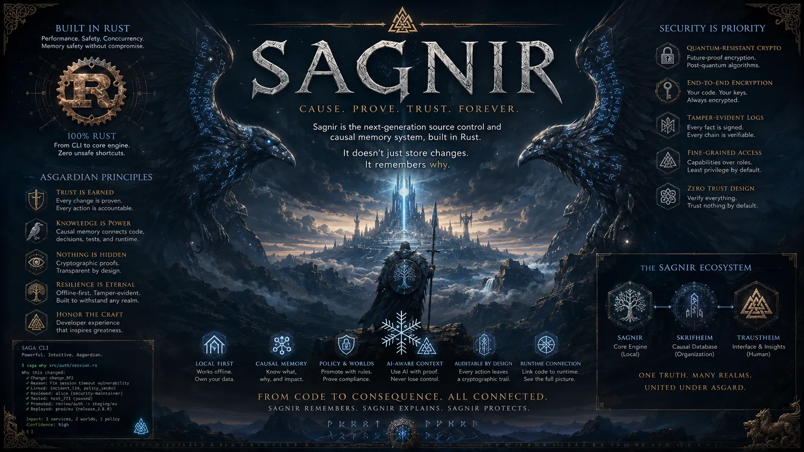

<p align="center">
  <b>Open source source-state engine, object format, proof model, local store, and protocol.</b><br>
  Intent first. Evidence backed. Local first. Built for proof-carrying source-state work.
</p>

<div align="center">
  <a href="docs/IMPLEMENTATION_PLAN.md">Implementation Plan</a>
  -
  <a href="docs/VERSION_PLAN.md">Version Plan</a>
  -
  <a href="docs/causal-memory.md">Causal Memory</a>
  -
  <a href="SECURITY.md">Security</a>
</div>

<br>

<p align="center">
  
</p>

# Sagnir

Sagnir is an open source source-state engine, object format, proof model, local
store, and protocol.

The command-line interface is `saga`.

Sagnir is not a Git rewrite. It is a local-first system for intent, changes,
evidence, world transitions, and artifacts. A realm is the local source-state
workspace. A change starts as stated intent, then becomes one or more sealed
revisions. Evidence such as tests, reviews, policy decisions, signatures, and
facts can be attached to that state before it is trusted.

Worlds are named states such as draft, review, staging, production, audit, or
simulation. Moving source state between worlds is a proof and policy decision,
not just a pointer update. Sagnir is designed to answer practical questions
like what changed, why it changed, what proved it, who reviewed it, what policy
accepted it, and what downstream state may be affected.

The 1.0 target is a serious production-ready CLI that can initialize a local
realm, inspect source state, seal changes, record evidence, verify proofs,
promote worlds, protect encrypted realms, build proof-carrying bundles, and
sync without requiring a hosted service or external database.

Sagnir is licensed under the European Union Public Licence 1.2.

## What Works Today

### Repository Foundation

| Capability | Status | Notes |
| --- | --- | --- |
| Rust workspace | Active | Rust 2024 workspace pinned to Rust stable `1.97.0`. |
| License baseline | Active | EUPL-1.2. |
| CLI router | Active | `saga help`, `saga version`, `saga init --dry-run`, unknown commands, and extra arguments have stable tested output. |
| Focused crates | Active | Core, codec, object, store, worktree, change, world, fact, policy, crypto, proof, sync, CLI, and daemon scaffolds. |
| `no_std` trusted crates | Active | Core library scaffolds use `#![no_std]` where practical. |
| Unsafe policy | Active | Trusted crates forbid unsafe Rust. |
| Modularity policy | Active | File-size and module-boundary checks prevent oversized implementation files. |

### Security And Release Gates

| Capability | Status | Notes |
| --- | --- | --- |
| Local check gate | Active | `scripts/checks.sh` runs formatting, docs, metadata, modularity, security policy, dependency policy, lint, and tests. |
| Dependency policy | Active | `cargo deny check` and `cargo audit` are required through `scripts/security_tool_gate.sh`. |
| Pentest stop rule | Active | Release gates refuse to tag until the matching permanent pentest report is `Status: PASS`. |
| Release notes validation | Active | Release notes must use the Sagnir release-note shape. |
| Pentest report validation | Active | Permanent pentest reports must include status, commit, tester, date, scope, and notes. |
| Container base pinning | Active | Rootless container build paths pin base images by digest. |
| CI supply-chain hardening | Active | GitHub Actions checkout is SHA-pinned and CI security tools install from checksum-verified crate archives. |
| CodeQL | Repository setting | GitHub CodeQL default setup must be enabled in repository security settings. |

### Source-State Model

| Capability | Status | Notes |
| --- | --- | --- |
| Core IDs and bounds | Active | Typed ID wrappers, bounded names, explicit format-version admission, case-folded `.saga` control-path rejection, redacted ID debug output, and timing-hardened equality APIs for sensitive IDs. |
| Canonical codec | Active | Fixed-width integer readers and writers, byte-string encoding, bounded list-length encoding, fail-closed buffer writes, and malformed scalar tests. |
| Object identity, headers, and graph | Active | Domain-separated object types, fail-closed hash algorithm parsing, canonical object ID display and parse, fixed object headers, bounded in-memory object graph verification, iterative graph traversal, graph fuzz targets, parser-enforced body availability, flags admission, and malformed header tests. |
| Local store layout | Active on Unix | `saga init` uses owner-checked, handle-relative storage on Unix. Other targets fail closed before creating `.saga` until a native backend is admitted; `saga init --dry-run` remains portable. |
| Realm and verification config | Active | Bounded `no_std` parsers and canonical writers for `standard`, `solo`, `team`, and `regulated` profiles plus bounded-batch, lazy-cone, and full-world resource metadata. |
| Local store metadata | Scaffolded | WAL frame kind scaffolds and CRC-32C crash-corruption checks bound to frame kind, transaction ID, and payload. |
| Worktree path rules | Scaffolded | Control-path exclusion, non-control dotfile rejection, path traversal rejection, control-character rejection, separator policy, and symlink-boundary proof types for future filesystem I/O. |
| Policy metadata | Scaffolded | Policy results, validated obligation bitmasks, and named obligation checks. |
| Crypto envelope metadata | Scaffolded | Algorithm admission, algorithm-specific signature bounds, hybrid signature binding policy, `subtle`-backed equality, `sanitization`-backed owned signature clearing, and redacted debug output. |
| Bundle metadata | Scaffolded | Bundle manifest counts are bounded before future parser allocation paths. |

### Planned Core Tracks

| Track | Status | Target |
| --- | --- | --- |
| Canonical local store | Planned | Durable objects, WAL recovery, local fsck, and rebuildable indexes. |
| Worktree and worlds | Planned | `saga status`, `saga diff`, world open/list/switch, and dirty-worktree protection. |
| Changes and sealing | Planned | Intent-first changes, immutable revisions, amend chains, and operation ledger. |
| Proofs and promotion | Planned | Offline object proofs, local policy files, deterministic promotion preflight, and rollback preflight. |
| Causal memory | Planned | Events, facts, causal indexes, explanations, context packs, `saga why`, `saga explain`, `saga trace`, `saga impact`, and bounded `saga ask`. |
| Native encrypted realms | Planned | `saga encrypt project`, `saga unlock`, `saga lock`, encrypted local storage, recipient slots, rekeying, leak scanning, and future compartments. |
| Bundles and sync | Planned | Proof-carrying bundles, encrypted bundles, blind/split-trust sync modes, and optional `sagad` remote support. |
| Production hardening | Planned | Malicious corpora, expanded fuzz/model tests, cross-platform gates, rootless Podman release gates, SBOMs, and 1.0 release evidence. |

## Why Sagnir

- **Intent first**: a change starts with intent, not just a file delta.
- **Evidence backed**: tests, reviews, policy decisions, proofs, and facts are
  first-class release inputs.
- **World based**: source state moves through named worlds by proof and policy,
  not by destructive history mutation.
- **Causal memory**: Sagnir is designed to explain why a change happened, what
  proved it, what trusted it, and what depends on it.
- **Local first**: useful source-state work must not require a hosted service.
- **Security first**: parsers, bundles, worktree paths, release gates, and
  supply-chain inputs are treated as hostile until verified.
- **Modular Rust**: focused crates keep implementation boundaries testable and
  prevent thousand-line core files.

## Quick Start

Build the workspace:

```bash
cargo build --workspace
```

Run the tests:

```bash
cargo test --workspace
```

Run the CLI:

```bash
cargo run -p sagnir-cli --bin saga -- version
```

Run the normal local gate:

```bash
scripts/checks.sh
```

Run the security tool gate directly:

```bash
scripts/security_tool_gate.sh
```

Run the rootless Podman smoke path:

```bash
scripts/podman_smoke.sh
```

Run the current release gate:

```bash
scripts/release_0_10_gate.sh
```

## Current Release Line

The repository is past `v0.9.0` and is currently working through `v0.10.0`, the
realm identity and bounded local configuration baseline.

Current release discipline:

- implementation reaches a clean version stop;
- the exact commit is handed to pentest;
- root `PENTEST.md` is scratch input only and must not be committed;
- findings are fixed before tag;
- permanent reports live under `security/pentest/`;
- release gates require `Status: PASS` before tagging;
- tags are created only after explicit maintainer instruction.

## Documentation

- [Implementation Plan](docs/IMPLEMENTATION_PLAN.md)
- [Version Plan](docs/VERSION_PLAN.md)
- [Architecture](docs/architecture.md)
- [Command Design](docs/command-design.md)
- [Causal Memory](docs/causal-memory.md)
- [Object Format](docs/object-format.md)
- [Hash Migration Plan](docs/hash-migration-plan.md)
- [Local Store](docs/local-store.md)
- [World Model](docs/world-model.md)
- [Proof Model](docs/proof-model.md)
- [Signature Policy](docs/signature-policy.md)
- [Vault Encryption](docs/vault-encryption.md)
- [Protocol](docs/protocol.md)
- [Security Controls](docs/security-controls.md)
- [Supply-Chain Security](docs/supply-chain-security.md)
- [Container Image Policy](docs/container-image-policy.md)
- [Threat Model](docs/threat-model.md)
- [Toolchain Policy](docs/toolchain-policy.md)
- [Modularity Policy](docs/modularity-policy.md)
- [Unsafe Policy](docs/unsafe-policy.md)
- [Release Runbook](docs/release-runbook.md)

## License

Sagnir is licensed under the European Union Public Licence 1.2.
